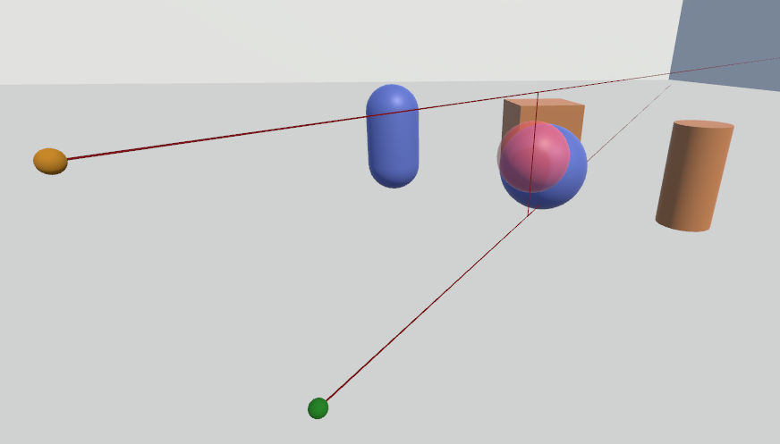

# Table of Contents
- [Virtual-interaction-library](#virtual-interaction-library)
  - [Summary and Goal](#summary-and-goal)
  - [Example Integration](#example-integration)
    - [Keyboard and Mouse](#keyboard-and-mouse)
    - [SteamVR](#steamvr)
  - [Interaction Techniques](#interaction-techniques)
    - [Ray-Cast](#ray-cast)
    - [Depth-Ray](#depth-ray)
    - [iSith](#isith)
    - [Spindle + Wheel technique](#spindle--wheel-technique)
   - [Navigation Techniques](#navigation-techniques)
    - [Steering](#steering)
    - [Grab the Air](#grab-the-air)
    - [Point and Teleport](#point-and-teleport)
    - [World in Miniature](#world-in-miniature)

# Virtual-interaction-library
Library for interaction and navigation techniques. References as links with names.

## Summary and Goal
The main goal of this library is to provide an easy to use framework with a few interaction and navigation techniques as a base for developers to implement new techniques. 
Techniques that are created using this library do not have to rely on a specific hardware solution. 
This is achieved by using a component that manages all techniques and registered controllers while providing a method to notify techniques that can be invoked from any script. 
Upon invocation, the library notifies all interaction and navigation techniques that are registered for a controller with the necessary information on which button was pressed or in which state a button currently is. 
This allows for integration into any existing solution by simply rerouting the inputs to the managing component (VRIL_Manager).

## Example Integration
To show how the interaction library can be used, two example scripts are implemented. Scenes for each example have been set up in Unity that utilize said example scripts.

### Keyboard and Mouse
The *VRIL_Keyboard* script allows the user to move, rotate, select and activate a technique.
This script simply remaps any input from the keyboard or mouse and notifies the *VRIL_Manger*.
Additionally, the script also shows which controller is currently selected which can be seen in the figure below on the top left side.


###  SteamVR
The [SteamVR]([https://www.google.com](https://steamcommunity.com/steamvr)) example script utilizes the default actions that are generated on start. 
Actions were introduced with SteamVR 2.0 and allow developers to subscribe to an action instead of checking input from the controller manually.
To use said actions or create new ones, the SteamVR input window in Unity offers a variety of options (package has to be installed first, as well as the SteamVR software).
If these actions have been generated, they can be bound to a specific controller input action like a button or a touchpad.
After actions are bound and generated, developers can subscribe or attach a new listener to an action.
The example script utilizes 4 of the default actions, that are auto-generated when opening the SteamVR Input for the first time, and registers listeners to each one.
After any input from the controller was detected, the *VRIL_Manager* will be notified.
In the figure below, an example for the *iSith* technique with SteamVR can be seen.


## Interaction Techniques
These are the interaction techniques that are implemented in the library. An example image demonstrates the use of the technique described.

### Ray-Cast
The Ray-Casting technique (earliest version mentioned by [Bolt](https://dl.acm.org/citation.cfm?doid=800250.807503), later again by [Bowman and Hodges](https://dl.acm.org/citation.cfm?doid=253284.253301)) is an interaction technique that utilizes a single controller with a line to show the user what objects can be selected. Anything the line touches and is selectable can be selected.
The ray-casting technique is implemented by using a single [line renderer](https://docs.unity3d.com/ScriptReference/LineRenderer.html). 
By using a [special attribute](https://docs.unity3d.com/ScriptReference/RequireComponent.html) from the Unity scripting API, a line renderer will automatically be attached to the parent game object of the script if no line renderer is present:
```csharp
[RequireComponent(typeof(LineRenderer))]
```
The line renderer is used to create a single line moving forward from the first registered controller with a customizable maximum distance. 
Line width, starting and ending width as well as the color of the line can be adjusted in the automatically created line renderer script.
Since the ray should be able to select interactable objects (objects that have the *VRIL_Interactable* component attached), a [Physics.Raycast](https://docs.unity3d.com/ScriptReference/Physics.Raycast.html) from the Unity scripting API is used.
The ray is provided with a point of origin, direction and a maximum length and any objects that collide with said ray will be selected. 

An example of the Ray-Cast technique can be seen in below.


### Depth-Ray
The Depth-Ray technique ([Grossman and Balakrishnan](https://dl.acm.org/citation.cfm?doid=1166253.1166257)) is similar to the single Ray-Cast technique but instead of relying on the ray to select objects, a sphere is used to indicate the area where objects can be selected. 
Together with another controller, the distance between the two controllers determines the distance of the model on the ray. Linear mapping is used to determine the distance and can be adjusted freely. 
The greater the distance between the two registered controllers for this technique, the greater the distance of the model on the line to the controller where the ray originates. 
The selection model indicates the area in which an object can be selected. If another model with a different mesh is used like a quad or cylinder, the model will not accurately represent the selection area since a sphere ray cast is used to check for objects in the area.
This technique provides a small set of options like the model size, initial sphere distance and linear distance mapping.

An example of this technique can be seen below.


### iSith
The iSith technique ([Wyss, Blach, and Bues](https://ieeexplore.ieee.org/abstract/document/1647507)) utilizes two controllers to select an object. A ray from each of the controllers is created that expands in front of the controller with a maximum distance. 
If those two intersect with one another a model is created. 
This model can grow or shrink in size depending on the distance between the two main rays from the controllers.
The model indicates the region in which an object can be selected.
  
The iSith technique implements three line renderers.
Since the line renderers are only instantiated at runtime (there is currently no way to require 3 instances of a line renderer via class attribute), a small list of options is provided for the ray: width, color, the line material, the shadow casting mode and the maximum distance of the ray.
One line is created at each controller position moving forward with the options specified. The third line from the last renderer is used to indicate the shortest distance between the two forward vectors from each controller. 
The line will not be displayed if one vector is not in front of the other (one controller is pointing behind the other controller).
If there is a shortest distance between the two vectors, a custom model of a transparent sphere is placed in the middle between the two vectors.
  
The provided model will be automatically resized based on the two options *MinSphereDiagonal and MaxSphereDiagonal*. As the rays are further apart from each other the model can be resized to fit the desired size.
This model can be replaced with any other model as long as no component that creates a [collider](https://docs.unity3d.com/ScriptReference/Collider.html) around the model is attached to it.
The model, however, does not indicate the space in which objects can be selected if it has a different mesh than a sphere.
Every frame, the interaction technique will cast a sphere, which size corresponds to the *MinSphereDiagonal and MaxSphereDiagonal* options that are used to resize the used model.
Any overlapping objects that have the *VRIL_Interactable* component attached will be selected by using a sphere ray-cast.
To make development easier, the *OnDrawGizmos* function from the Unity scripting API is used to show the size of the actual sphere which can be seen in the scene view in Unity if activated.
  
Depending on the position and if there is a shortest distance between the two lines, the provided model will be set active or inactive to provide better performance instead of deleting it. 
Setting the model inactive means it will not be visible anymore.
If the model is invisible no objects can be selected even if the rays point at objects as the main usage is to select objects with the sphere instead of the rays.

An example of the iSith implementation in action can be seen below.




### Spindle + Wheel technique
The Spindle + Wheel technique ([Cho and Wartell](https://ieeexplore.ieee.org/abstract/document/7131738)) is an extension of the original Spindle ([Mapes and Moshell.](https://doi.org/10.1162/pres.1995.4.4.403)) technique.
While the iSith technique focuses on the selection part of an interaction technique by providing a unique way of selection with two rays, the Spindle + Wheel technique focuses on the manipulation part after selecting an object. 
  
An object is selected by using both controllers and a selection model similar to the iSith technique. 
But instead of using two rays only one ray is instantiated. At the middle between the two controllers, a transparent model is placed to indicate the area in which objects can be selected.
After an object has been selected the technique can be switched to the manipulation mode which results in the selected object being placed in between the two controllers.
The manipulation mode then allows users to manipulate an object's rotation, position and the scale:  
- **Scaling**:  
    The distance between the two controllers translates to the scale of the object.  
- **XYZ axis translation**:  
    Moving both controllers allow for the placement of the object along all axes.  
- **YZ axis rotation**:  
    Asymmetric hand movement result in yz rotations on the object.  
- **X rotations**:  
    Moving the dominant-hand controller results in changed x rotations on the object that translate to the controller rotation.  
  
An example of this technique can be seen below.


## Navigation Techniques
These are the navigation techniques that are implemented in the library. An example image demonstrates the use of the technique described.

### Steering
The library provides both gaze-directed steering and hand-directed steering techniques ([Mine](https://pdfs.semanticscholar.org/69ff/1367d0221357a806d3c05df2b787ed90bdb7.pdf)). On application startup, it is identified whether the camera or controller object is used for steering, depending on the value provided in option *Technique*. When the steering technique gets activated, the viewpoint is transferred repeatedly to a new position as long as the button is pressed. The target position is calculated by adding the object's forwards to the current position of the viewpoint. In addition, the result is calculated by the provided velocity. The steering technique provides options that must be set in advance to enable movement along the desired axes. For example, to be able to fly through the virtual space, all axes have to be enabled.

### Grab the Air
The grab the air technique ([Mapes and Moshell.](https://dl.acm.org/doi/abs/10.1162/pres.1995.4.4.403)) transfers not the viewpoint to a new position, but the whole virtual world around the user. The position of the user remains the same. To avoid moving each individual object separately, a parent world object containing all objects of the virtual world has to be attached to the technique component in the Unity editor. This world object is then used by the technique to apply position changes of the controller to the world. When the technique gets activated, a co-routine is started which continuously applies the position changes of the controller to the world object as long as the button is pressed. Each controller position change is determined by the vector from its previous position (world is not attached to the controller!). Similar to the steering techniques, options are provided to enable individual axes. To prevent the user from being affected by any position changes, the viewpoint cannot be a child object of the world, it must be separated from it. Since many grab motions are needed for travelling larger distances within the virtual world, a scale factor is provided. The vector for the difference of the controller positions is multiplied by this movement scalor to achieve that every controller motion results in larger position changes of the world.

### Point and Teleport
asd
### World in Miniature
asd
